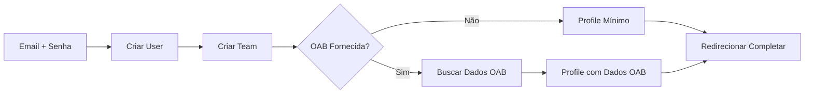
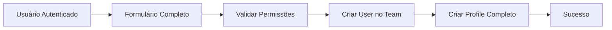
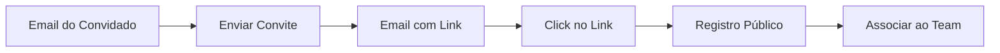

[Back](../README.md)

# User Registration System

## Visão Geral

O sistema de registro do ProcStudio implementa múltiplos fluxos de criação de usuários, otimizados para diferentes contextos e necessidades. A arquitetura suporta onboarding progressivo e diferentes níveis de completude de dados.

## Tipos de Registro

### 1. Registro Público (Primeiro Acesso)
- **Contexto**: Novos usuários descobrindo a plataforma
- **Acesso**: Sem autenticação necessária
- **Criação**: User + Team + UserProfile parcial
- **Integração OAB**: Busca automática de dados se fornecida
- **Subdomínio**: Geração automática para o novo time

### 2. Criação Privada (Usuário Autenticado)
- **Contexto**: Advogado criando perfil para colega
- **Acesso**: Requer autenticação e permissões
- **Criação**: User + UserProfile completo no team existente
- **Validação**: Todos os campos obrigatórios de uma vez
- **Completude**: Não requer etapa adicional

### 3. Sistema de Convites (Novo MVP)
- **Contexto**: Convidar advogado apenas com email
- **Acesso**: Requer autenticação para enviar
- **Processo**: Email → Link → Registro público
- **Vantagem**: Reduz fricção no convite

## Arquitetura de Componentes

### Estrutura em 3 Camadas

```
📁 forms_commons/                # Componentes Atômicos
├── Email.svelte                 # Campo de email com validação
├── Cpf.svelte                   # CPF com formatação e validação
├── Phone.svelte                 # Telefone com máscara
├── OabId.svelte                 # OAB com validação de formato
├── Address.svelte               # Endereço completo
├── Cep.svelte                   # CEP com busca de endereço
├── Bank.svelte                  # Dados bancários com PIX
├── Rg.svelte                    # [NOVO] RG com formatação
├── Gender.svelte                # [NOVO] Seleção de gênero (M/F)
├── CivilStatus.svelte           # [NOVO] Estado civil contextual
├── Birth.svelte                 # [NOVO] Data nascimento validada
├── Nationality.svelte           # [NOVO] Nacionalidade
└── Name.svelte                  # [NOVO] Nome com validação

📁 forms_users_wrappers/         # Agrupamentos Lógicos
├── UserBasicInfo.svelte         # name, last_name, role, oab
├── UserPersonalInfo.svelte      # cpf, rg, gender, civil_status
├── UserContactInfo.svelte       # phone, address, email
├── UserCredentials.svelte       # email, password, confirmation
└── UserBankInfo.svelte          # bank_accounts array

📁 pages/                        # Formulários Unificados
└── UserFormUnified.svelte       # Formulário único adaptativo
```

### Componente Unificado

```svelte
<!-- UserFormUnified.svelte -->
<script lang="ts">
  import { userFormStore } from '$lib/stores/userFormStore.svelte';
  
  export let mode: FormMode;
  export let userData = {};
  export let missingFields = [];
  
  const store = userFormStore.create(mode, userData, missingFields);
</script>

{#if mode === 'invite'}
  <!-- Modo Convite: Apenas Email -->
  <Email bind:value={store.formData.email} required />
  
{:else if mode === 'public_registration'}
  <!-- Registro Público: Dados Essenciais -->
  <UserCredentials bind:formData={store.formData} />
  <UserBasicInfo 
    bind:formData={store.formData}
    oabOptional={true}
  />
  
{:else if mode === 'private_creation'}
  <!-- Criação Privada: Formulário Completo -->
  <UserCredentials bind:formData={store.formData} />
  <UserBasicInfo 
    bind:formData={store.formData}
    oabRequired={store.formData.role === 'lawyer'}
  />
  <UserPersonalInfo bind:formData={store.formData} />
  <UserContactInfo bind:formData={store.formData} />
  <UserBankInfo bind:formData={store.formData} />
  
{:else if mode === 'profile_completion'}
  <!-- Completar Perfil: Apenas Campos Faltantes -->
  {#each store.missingFieldGroups as group}
    {#if group === 'personal'}
      <UserPersonalInfo bind:formData={store.formData} />
    {:else if group === 'contact'}
      <UserContactInfo bind:formData={store.formData} />
    {:else if group === 'bank'}
      <UserBankInfo bind:formData={store.formData} />
    {/if}
  {/each}
{/if}

<button on:click={store.submit}>
  {store.submitLabel}
</button>
```

## Store Unificado

### userFormStore.svelte.ts

```typescript
import { writable, derived } from 'svelte/store';
import type { FormMode, UserFormData } from '$lib/types/user-form';

class UserFormStore {
  // Estado interno
  private state = $state({
    mode: 'public_registration' as FormMode,
    formData: {} as UserFormData,
    validationConfig: {} as ValidationConfig,
    missingFields: [] as string[],
    loading: false,
    errors: {}
  });

  // Configuração dinâmica baseada no modo
  constructor(mode: FormMode, initialData = {}, missingFields = []) {
    this.state.mode = mode;
    this.state.formData = { ...this.getDefaultData(mode), ...initialData };
    this.state.missingFields = missingFields;
    this.state.validationConfig = this.getValidationConfig(mode);
  }

  // Validação dinâmica por modo
  private getValidationConfig(mode: FormMode): ValidationConfig {
    const configs = {
      invite: {
        email: { required: true, validator: validateEmail }
      },
      public_registration: {
        email: { required: true, validator: validateEmail },
        password: { required: true, minLength: 6 },
        name: { required: false }, // Auto-preenchido via OAB
        oab: { required: false }
      },
      private_creation: {
        email: { required: true, validator: validateEmail },
        password: { required: true, minLength: 6 },
        name: { required: true },
        last_name: { required: true },
        role: { required: true, enum: ['lawyer'] },
        oab: { required: true, when: (data) => data.role === 'lawyer' },
        cpf: { required: true, validator: validateCPF }
      },
      profile_completion: this.generateMissingFieldsConfig()
    };
    
    return configs[mode];
  }

  // Submissão adaptativa
  async submit() {
    if (!this.isValid) return;
    
    this.state.loading = true;
    try {
      const endpoint = this.getEndpoint();
      const payload = this.preparePayload();
      const result = await api[endpoint](payload);
      
      if (result.success) {
        this.handleSuccess(result);
      }
    } catch (error) {
      this.state.errors = parseApiErrors(error);
    } finally {
      this.state.loading = false;
    }
  }

  // Endpoint baseado no modo
  private getEndpoint(): string {
    const endpoints = {
      public_registration: 'auth.publicRegister',
      private_creation: 'users.createUserProfile',
      profile_completion: 'auth.completeProfile',
      invite: 'users.sendInvite'
    };
    return endpoints[this.state.mode];
  }

  // Preparação de payload
  private preparePayload() {
    if (this.state.mode === 'invite') {
      return { email: this.state.formData.email };
    }
    
    if (this.state.mode === 'private_creation') {
      return {
        user_profile: {
          ...this.state.formData,
          user_attributes: {
            email: this.state.formData.email,
            password: this.state.formData.password,
            password_confirmation: this.state.formData.password_confirmation
          },
          phones_attributes: this.formatPhones(),
          addresses_attributes: this.formatAddresses(),
          bank_accounts_attributes: this.formatBankAccounts()
        }
      };
    }
    
    // Outros modos...
    return this.state.formData;
  }

  // Validação reativa
  get isValid() {
    return $derived(() => {
      const errors = validateForm(this.state.formData, this.state.validationConfig);
      return errors.length === 0;
    });
  }

  // Label do botão contextual
  get submitLabel() {
    const labels = {
      public_registration: 'Criar Conta',
      private_creation: 'Criar Usuário',
      profile_completion: 'Completar Cadastro',
      invite: 'Enviar Convite'
    };
    return labels[this.state.mode];
  }
}

export const userFormStore = {
  create: (mode, data, fields) => new UserFormStore(mode, data, fields)
};
```

## Fluxo de Dados

### 1. Registro Público



### 2. Criação Privada



### 3. Sistema de Convites



## Validações por Contexto

### Matriz de Campos Obrigatórios

| Campo | Público | Privado | Completar | Convite |
|-------|---------|---------|-----------|---------|
| **email** | ✅ | ✅ | ❌ | ✅ |
| **password** | ✅ | ✅ | ❌ | ❌ |
| **name** | ⚠️ | ✅ | ✅* | ❌ |
| **role** | 🔄 | ✅ | ✅* | ❌ |
| **oab** | ⚪ | ✅** | ✅** | ❌ |
| **cpf** | ❌ | ✅ | ✅* | ❌ |
| **phone** | ❌ | ⚪ | ✅* | ❌ |
| **address** | ❌ | ⚪ | ✅* | ❌ |
| **bank** | ❌ | ⚪ | ⚪ | ❌ |

**Legenda:**
- ✅ Obrigatório
- ❌ Não solicitado
- ⚪ Opcional
- ⚠️ Auto-preenchido se OAB
- 🔄 Default: lawyer
- \* Se faltante
- ** Se role=lawyer

## API Endpoints

### Registro Público
```http
POST /api/v1/public/user_registration
Content-Type: application/json

{
  "user": {
    "email": "advogado@example.com",
    "password": "senha123",
    "password_confirmation": "senha123",
    "oab": "PR_54159"  // Opcional
  }
}

Response 201:
{
  "success": true,
  "data": {
    "user": { ... },
    "team": { ... },
    "profile": { ... },
    "needs_completion": true
  }
}
```

### Criação Privada
```http
POST /api/v1/user_profiles
Authorization: Bearer {token}
Content-Type: application/json

{
  "user_profile": {
    "name": "João",
    "last_name": "Silva",
    "role": "lawyer",
    "oab": "SP_123456",
    "cpf": "123.456.789-00",
    "user_attributes": {
      "email": "joao@example.com",
      "password": "senha123",
      "password_confirmation": "senha123"
    },
    "phones_attributes": [
      { "phone_number": "(11) 99999-9999" }
    ],
    "addresses_attributes": [
      {
        "street": "Rua Example",
        "number": "123",
        "city": "São Paulo",
        "state": "SP",
        "zip_code": "01000-000"
      }
    ],
    "bank_accounts_attributes": [
      {
        "bank_name": "Banco do Brasil",
        "account_type": "checking",
        "agency": "1234",
        "account_number": "12345-6",
        "pix_key": "email@example.com"
      }
    ]
  }
}

Response 201:
{
  "success": true,
  "data": {
    "id": "123",
    "type": "user_profile",
    "attributes": { ... }
  }
}
```

### Enviar Convite
```http
POST /api/v1/user_profiles/invite
Authorization: Bearer {token}
Content-Type: application/json

{
  "invite": {
    "email": "convidado@example.com",
    "message": "Olá, gostaria de convidar você para nosso escritório."  // Opcional
  }
}

Response 200:
{
  "success": true,
  "message": "Convite enviado com sucesso",
  "data": {
    "invite_id": "abc123",
    "expires_at": "2024-12-31T23:59:59Z"
  }
}
```

## Integração com OAB

### Fluxo de Dados OAB

1. **Validação**: Formato UF_NUMERO (ex: PR_54159)
2. **Busca**: API Legal Data retorna dados do advogado
3. **Preenchimento**: Auto-complete de campos
   - name, last_name
   - gender (inferido)
   - addresses (se disponível)
   - phones (se disponível)
   - avatar (download da foto)
4. **Armazenamento**: UserProfile com dados enriquecidos

### Exemplo de Resposta OAB
```json
{
  "name": "João",
  "last_name": "Silva Santos",
  "oab": "PR_54159",
  "gender": "male",
  "profile_picture_url": "https://oab.org.br/photos/12345.jpg",
  "address": {
    "street": "Rua da OAB",
    "number": "100",
    "city": "Curitiba",
    "state": "PR",
    "zip_code": "80000-000"
  },
  "phone": "(41) 3333-3333"
}
```

## Geração de Team e Subdomínio

### Lógica de Criação

```ruby
# TeamSubdomainGenerator
def self.generate(lawyer_name: nil, email: nil)
  base = lawyer_name || email.split('@').first
  slug = base.parameterize
  
  # Garantir unicidade
  counter = 0
  subdomain = slug
  while Team.exists?(subdomain: subdomain)
    counter += 1
    subdomain = "#{slug}-#{counter}"
  end
  
  subdomain
end

# Exemplos:
# João Silva → joao-silva
# maria@example.com → maria
# João Silva (duplicado) → joao-silva-1
```

## Segurança e Boas Práticas

### Validações de Segurança
- **Senhas**: Mínimo 6 caracteres, hash bcrypt
- **Email**: Validação de formato e unicidade
- **CPF**: Validação de dígitos verificadores
- **OAB**: Validação contra API externa
- **Team Scoping**: Isolamento automático por time

### Performance
- **Lazy Loading**: Carregar campos conforme necessário
- **Debounce**: Validações com delay de 300ms
- **Cache**: Dados OAB cacheados por 24h
- **Batch Operations**: Criar relacionamentos em transação

### UX/UI
- **Progressive Disclosure**: Mostrar campos gradualmente
- **Inline Validation**: Feedback imediato nos campos
- **Smart Defaults**: Pré-seleções inteligentes
- **Error Recovery**: Preservar dados em caso de erro

## Migração e Evolução

### Tarefas Pendentes
1. ✅ Unificar UserForm e ProfileCompletion
2. ⏳ Implementar sistema de convites
3. ⏳ Adicionar fluxo de dados bancários
4. ✅ Remover roles não utilizados
5. ✅ Automatizar status active

### Roadmap Futuro
- OAuth2 com Google/Microsoft
- 2FA para segurança adicional
- Bulk invite (CSV upload)
- Templates de perfil por escritório
- Integração com sistemas de RH

## Troubleshooting

### Problemas Comuns

| Problema | Causa | Solução |
|----------|-------|---------|
| Email duplicado | Usuário já existe | Usar fluxo de recuperação |
| OAB inválida | Formato incorreto | Verificar UF_NUMERO |
| Perfil incompleto | Campos faltantes | Redirecionar para completar |
| Team não criado | Erro na transação | Verificar logs, retry |
| Convite expirado | Timeout 48h | Reenviar convite |

### Logs e Monitoramento
```ruby
# Pontos de log importantes
Rails.logger.info "[USER_REG] New registration: #{email}"
Rails.logger.info "[USER_REG] OAB lookup: #{oab}"
Rails.logger.info "[USER_REG] Team created: #{subdomain}"
Rails.logger.error "[USER_REG] Failed: #{errors.full_messages}"
```