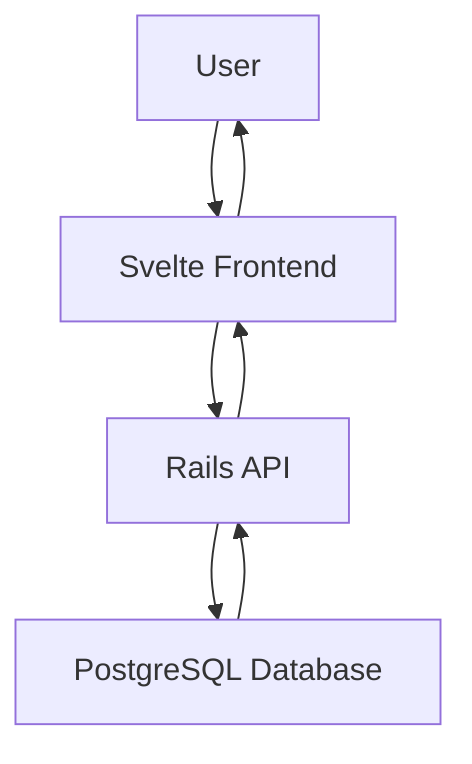

# Documentation Guidelines

## Core Documentation Principles

### Documentation Philosophy
- **User-Focused**: Write documentation from the user's perspective
- **Clarity Over Cleverness**: Prefer simple, clear explanations
- **Maintain Accuracy**: Keep documentation in sync with code changes
- **Examples First**: Show concrete examples before abstract concepts

### Documentation Standards

#### File Naming Conventions
- Use kebab-case for file names: `user-authentication.md`
- Use descriptive names that indicate content: `api-endpoints.md` not `endpoints.md`
- Group related documentation in directories: `/docs/api/`, `/docs/guides/`

#### Content Structure
```markdown
# Title (H1 - only one per document)

Brief description of what this document covers.

## Main Section (H2)

Content for the main section.

### Subsection (H3)

More detailed content.

#### Detail Section (H4)

Specific implementation details.

## Examples

Concrete examples with code snippets.

## References

Links to related documentation.
```

### Code Documentation

#### Inline Comments
```javascript
// Good: Explains WHY, not WHAT
// Debounce search to avoid excessive API calls
const debouncedSearch = debounce(searchCustomers, 300);

// Bad: Explains obvious WHAT
// Set the value to true
isVisible = true;
```

#### Function Documentation
```javascript
/**
 * Calculates the total price including tax and discounts
 * @param {number} basePrice - The base price before calculations
 * @param {number} taxRate - Tax rate as decimal (0.1 for 10%)
 * @param {number} discount - Discount amount in currency units
 * @returns {number} Final price after tax and discount
 * @example
 * calculateTotal(100, 0.1, 15) // Returns 95
 */
function calculateTotal(basePrice, taxRate, discount) {
  return (basePrice * (1 + taxRate)) - discount;
}
```

#### API Documentation
```markdown
## POST /api/v1/customers

Creates a new customer record.

### Request

**Headers:**
- `Authorization: Bearer <token>` (required)
- `Content-Type: application/json`

**Body:**
```json
{
  "customer": {
    "name": "John Doe",
    "email": "john@example.com",
    "phone": "+1234567890"
  }
}
```

**Response:**

**Success (201):**
```json
{
  "data": {
    "id": "123",
    "type": "customer",
    "attributes": {
      "name": "John Doe",
      "email": "john@example.com",
      "phone": "+1234567890",
      "created_at": "2024-01-01T00:00:00Z"
    }
  }
}
```

**Error (422):**
```json
{
  "errors": [
    {
      "field": "email",
      "message": "is invalid"
    }
  ]
}
```
```

### README Structure

#### Project README Template
```markdown
# Project Name

Brief description of what the project does.

## Prerequisites

- Node.js 18+
- Ruby 3.2+
- PostgreSQL 14+

## Installation

```bash
# Clone the repository
git clone https://github.com/your-org/project-name.git

# Install dependencies
npm install
bundle install

# Setup database
rails db:create db:migrate db:seed
```

## Usage

Basic usage examples:

```bash
# Start development server
npm run dev

# Run tests
npm test
rails test
```

## Configuration

Environment variables needed:

```bash
DATABASE_URL=postgresql://localhost/myapp
API_KEY=your-api-key
```

## Contributing

See [CONTRIBUTING.md](CONTRIBUTING.md) for guidelines.

## License

MIT License - see [LICENSE](LICENSE) file.
```

### Changelog Guidelines

#### Semantic Versioning
Follow [Semantic Versioning](https://semver.org/):
- **MAJOR**: Breaking changes
- **MINOR**: New features (backward compatible)
- **PATCH**: Bug fixes (backward compatible)

#### Changelog Format
```markdown
# Changelog

## [Unreleased]

### Added
- New customer search functionality

### Changed
- Updated API response format for better consistency

### Fixed
- Fixed pagination bug in customer list

## [1.2.0] - 2024-01-15

### Added
- Customer management API endpoints
- Email validation for customer forms

### Changed
- Improved error handling in authentication

### Fixed
- Fixed memory leak in websocket connections

## [1.1.0] - 2024-01-01

Initial release with basic functionality.
```

### Architecture Documentation

#### System Overview Template
```markdown
# System Architecture

## Overview

High-level description of the system architecture.

## Components

### Frontend (Svelte)
- **Purpose**: User interface and client-side logic
- **Technology**: Svelte 5, TypeScript, Vite
- **Key Features**: Real-time updates, responsive design

### Backend (Rails)
- **Purpose**: API server and business logic
- **Technology**: Rails 8.0, Ruby 3.2, PostgreSQL
- **Key Features**: RESTful API, authentication, data persistence

### Database (PostgreSQL)
- **Purpose**: Data storage and management
- **Key Features**: ACID transactions, full-text search, JSON support

## Data Flow



## Security Considerations

- JWT-based authentication
- HTTPS encryption in production
- Input validation and sanitization
- SQL injection prevention via ActiveRecord
```

### Deployment Documentation

```markdown
# Deployment Guide

## Production Environment

### Requirements
- Ubuntu 20.04 or later
- Docker and Docker Compose
- SSL certificate for HTTPS

### Deployment Steps

1. **Setup Environment:**
   ```bash
   # Copy environment file
   cp .env.example .env.production
   
   # Edit configuration
   vim .env.production
   ```

2. **Deploy with Docker:**
   ```bash
   # Build and start services
   docker-compose -f docker-compose.prod.yml up -d
   
   # Run database migrations
   docker-compose exec web rails db:migrate
   ```

3. **Verify Deployment:**
   ```bash
   # Check service health
   curl https://yourdomain.com/health
   ```

### Monitoring

- Application logs: `/var/log/app/`
- Database monitoring: PostgreSQL metrics
- Uptime monitoring: Configured health checks

### Rollback Procedure

1. Stop current containers
2. Deploy previous image version
3. Run any necessary database rollbacks
```

### Troubleshooting Documentation

```markdown
# Troubleshooting Guide

## Common Issues

### Database Connection Errors

**Symptoms:**
- Application fails to start
- "Cannot connect to database" errors

**Solutions:**
1. Check database service is running:
   ```bash
   systemctl status postgresql
   ```

2. Verify connection parameters in `.env`

3. Test database connectivity:
   ```bash
   rails db:migrate:status
   ```

### Performance Issues

**Symptoms:**
- Slow page load times
- High CPU usage

**Debugging Steps:**
1. Check application logs for slow queries
2. Monitor database performance:
   ```sql
   SELECT * FROM pg_stat_activity WHERE state = 'active';
   ```

3. Profile frontend performance with browser dev tools

### Authentication Problems

**Symptoms:**
- Users cannot log in
- "Invalid token" errors

**Solutions:**
1. Check JWT secret configuration
2. Verify token expiration settings
3. Clear browser cache and cookies
```

## Documentation Maintenance

### Regular Reviews
- Review documentation monthly for accuracy
- Update examples when APIs change
- Remove outdated information
- Add new features to relevant docs

### Version Control
- Keep documentation in same repository as code
- Review documentation changes in pull requests
- Tag documentation versions with releases

### Style Guidelines
- Use present tense ("Click the button" not "You will click")
- Use active voice ("The system generates reports" not "Reports are generated")
- Be concise but complete
- Use consistent terminology throughout

Remember: Good documentation is written for the person who will read it, not the person who wrote the code.