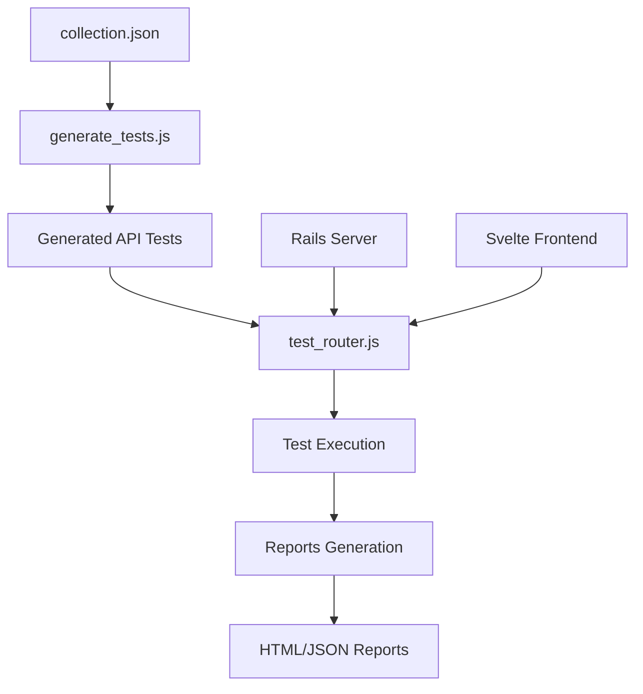

# ProcStudio Test Router - System Overview

## 🎯 What We've Built

This test router provides a **centralized testing hub** that consolidates all testing for the ProcStudio application (Rails API + Svelte Frontend) into a single, unified interface.

## 🏗️ Architecture

```
┌─────────────────────────────────────────────────────────────┐
│                    TEST ROUTER (test_router.js)            │
│                     Interactive Menu System                 │
└─────────────────────┬───────────────────────────────────────┘
                      │
          ┌───────────┼───────────┐
          │           │           │
          ▼           ▼           ▼
    ┌─────────┐ ┌─────────┐ ┌─────────────┐ ┌─────────┐
    │  UNIT   │ │   API   │ │ API-SVELTE  │ │   E2E   │
    │ TESTS   │ │ TESTS   │ │INTEGRATION  │ │ TESTS   │
    │         │ │         │ │   TESTS     │ │         │
    └─────────┘ └─────────┘ └─────────────┘ └─────────┘
         │           │             │             │
         ▼           ▼             ▼             ▼
    Rails RSpec  Generated     Custom       Playwright
    Tests        from Postman  Framework    Browser Tests
```

## 📋 Test Types & Coverage

### 1. Unit Tests (Rails RSpec) 🔧
- **Location**: `unit/run_rails_tests.js`
- **Target**: Backend business logic
- **Coverage**: Models, Controllers, Services, Jobs
- **Technology**: RSpec + SimpleCov
- **Features**: 
  - Interactive category selection
  - Coverage reporting
  - Failed test re-running
  - Parallel execution

### 2. API Tests (Generated from Postman) 🌐
- **Location**: `api/generate_tests.js` → Generated test files
- **Target**: HTTP endpoints directly
- **Coverage**: All 87 endpoints from collection.json
- **Technology**: Mocha + Axios + Custom generator
- **Features**:
  - Auto-generated from collection.json
  - Authentication handling
  - JSON:API validation
  - Retry logic
  - Performance monitoring

### 3. API-Svelte Integration Tests 🔄
- **Location**: `api_svelte/integration_tests.js`
- **Target**: Frontend ↔ Backend communication
- **Coverage**: CORS, Auth flow, Data flow, Error handling
- **Technology**: Custom integration framework
- **Features**:
  - CORS validation
  - Authentication flow testing
  - Data serialization checks
  - Error response validation
  - Performance characteristics

### 4. End-to-End Tests (Playwright) 🎭
- **Location**: `e2e/tests/`
- **Target**: Complete user workflows
- **Coverage**: User interactions, cross-browser, accessibility
- **Technology**: Playwright
- **Features**:
  - Multi-browser testing (Chrome, Firefox, Safari)
  - Mobile responsiveness
  - Accessibility testing
  - Visual regression
  - Video/screenshot capture

## 🚀 Quick Start Commands

```bash
# Setup everything
cd tests
chmod +x setup.sh
./setup.sh

# Interactive mode
node test_router.js

# Direct commands
npm run test:all        # All tests
npm run test:unit       # Rails RSpec
npm run test:api        # API endpoints
npm run test:api-svelte # Integration
npm run test:e2e        # Browser tests
```

## 📊 Generated Test Coverage

From the Postman collection, we automatically generated **19 test suites** covering **87 API endpoints**:

**Core Modules:**
- User Management (Users, Profiles, Teams)
- Customer Management (Customers, Profiles, Representatives)
- Office Management (Offices, Types, Areas)
- Work Management (Jobs, Works, Draft Works, Events)
- Administrative (Powers, Law Areas)

**Test Categories:**
- Authentication & Authorization
- CRUD operations
- Data validation
- Error handling
- Performance monitoring

## 🎛️ Configuration System

**Central Config**: `test_config.json`
```json
{
  "rails": { "command": "bundle exec rspec", "coverage": true },
  "api": { "baseUrl": "http://localhost:3000", "timeout": 30000 },
  "frontend": { "baseUrl": "http://localhost:5173" },
  "e2e": { "browser": "chromium", "screenshots": true }
}
```

**Environment Support**:
- Development
- Test
- CI/CD
- Production-like testing

## 📈 Reporting & Analytics

**Generated Reports**:
- HTML reports with visual results
- JSON reports for CI/CD integration
- JUnit XML for build systems
- Coverage reports with thresholds
- Performance metrics
- Screenshot/video artifacts

**Report Locations**:
- `reports/rspec_report.html` - Unit tests
- `reports/e2e-html-report/` - E2E tests
- `reports/*integration_report.*` - Integration tests
- `reports/archives/` - Historical runs

## 🔧 Key Features

### Auto-Generation
- **API Tests**: Generated from Postman collection.json
- **Test Data**: Auto-created for E2E scenarios
- **Auth States**: Pre-authenticated user sessions
- **Helper Functions**: Reusable test utilities

### Smart Test Management
- **Prerequisite Checking**: Validates servers before running
- **Failure Handling**: Retry logic and graceful degradation
- **State Management**: Clean setup/teardown
- **Parallel Execution**: Optimized for speed

### Developer Experience
- **Interactive Menu**: Easy test selection
- **Real-time Feedback**: Progress indicators and logging
- **Error Diagnosis**: Helpful error messages and debugging info
- **Documentation**: Comprehensive README for each test type

## 🌊 Data Flow Example



## 🎯 Testing Strategy

### Test Pyramid Implementation
```
    ┌─────────┐
    │   E2E   │  ← Few, but critical user journeys
    │  Tests  │
    ├─────────┤
    │Integration│ ← Frontend-backend communication
    │  Tests    │
    ├───────────┤
    │ API Tests │ ← All endpoints, comprehensive
    ├───────────┤
    │Unit Tests │ ← Many, fast, isolated
    └───────────┘
```

### Coverage Goals
- **Unit Tests**: 90%+ code coverage
- **API Tests**: 100% endpoint coverage
- **Integration**: Critical user flows
- **E2E**: Key business scenarios

## 🚦 CI/CD Integration

**GitHub Actions Ready**:
- Automated test execution
- Parallel test runs
- Artifact collection
- Report publishing
- Failure notifications

**Supporting Files**:
- `playwright.config.js` - E2E configuration
- `global-setup.js` - Test environment setup
- `global-teardown.js` - Cleanup and reporting
- `.mocharc.json` - API test configuration

## 📁 File Structure Summary

```
tests/
├── 📄 README.md              # Main documentation
├── 📄 OVERVIEW.md            # This file
├── 🎛️ test_router.js         # Main router
├── ⚙️ test_config.json       # Configuration
├── 📦 package.json           # Dependencies
├── 🔧 setup.sh              # Setup script
│
├── 📁 unit/                  # Rails RSpec integration
├── 📁 api/                   # Generated API tests
├── 📁 api_svelte/           # Integration tests
├── 📁 e2e/                  # Playwright E2E tests
├── 📁 shared/               # Utilities (Postman parser)
└── 📁 reports/              # Test results
```

## 🎉 What This Achieves

### For Developers
- **Single Command**: Run all tests with `npm run test:all`
- **Quick Feedback**: Fast unit and API tests for development
- **Comprehensive Coverage**: From unit to full user workflows
- **Easy Debugging**: Clear error messages and artifacts

### For QA Teams
- **Automated Testing**: No manual setup required
- **Visual Reports**: Easy-to-read HTML reports
- **Cross-browser**: Automated browser compatibility testing
- **Regression Prevention**: Comprehensive test coverage

### For DevOps/CI
- **CI/CD Ready**: JSON/XML reports for build systems
- **Parallel Execution**: Optimized for CI environments
- **Artifact Collection**: Screenshots, videos, logs
- **Environment Flexibility**: Works in any environment

### For Product Teams
- **Quality Assurance**: Comprehensive testing before releases
- **Performance Monitoring**: Built-in performance testing
- **Accessibility**: Automated accessibility checks
- **User-centric**: E2E tests mirror real user workflows

## 🎯 Success Metrics

This test system provides:

✅ **87 API endpoints** automatically tested
✅ **4 different test types** in one unified system  
✅ **Multi-browser** E2E testing
✅ **Automated test generation** from Postman collections
✅ **Comprehensive reporting** with visual results
✅ **CI/CD integration** ready out of the box
✅ **Developer-friendly** interactive interface
✅ **Production-ready** error handling and cleanup

## 🚀 Next Steps

1. **Run Setup**: `./tests/setup.sh`
2. **Start Servers**: Rails + Svelte
3. **Run Tests**: `node test_router.js`
4. **Review Reports**: Check `reports/` directory
5. **Integrate CI**: Use provided GitHub Actions example

**Happy Testing! 🧪**